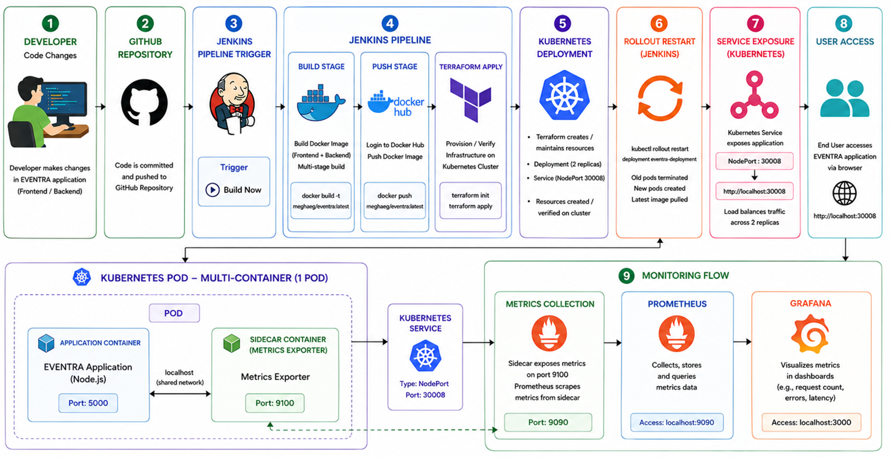

# EVENTRA – Automated CI/CD Pipeline with Kubernetes, Terraform & Monitoring 


EVENTRA is a full-stack MERN application deployed using a complete DevOps pipeline that automates build, containerization, deployment, and monitoring. The project demonstrates real-world implementation of CI/CD using Jenkins, Docker, Terraform, and Kubernetes, along with observability using Prometheus and Grafana.

---

## PROJECT OVERVIEW

This project automates the entire lifecycle of an application:

* Code is autopushed to GitHub using scripts
* Jenkins triggers the pipeline
* Docker builds and pushes the image
* Terraform provisions infrastructure
* Kubernetes deploys the application
* Prometheus collects metrics
* Grafana visualizes system performance

The system ensures scalability, reliability, and zero manual deployment effort.

---

## TECH STACK

**Frontend:** React.js
**Backend:** Node.js + Express.js
**Database:** MongoDB

**DevOps Tools:**

* Jenkins (CI/CD Automation)
* Docker (Containerization)
* Docker Hub (Image Registry)
* Terraform (Infrastructure as Code)
* Kubernetes (Container Orchestration)
* Prometheus (Monitoring)
* Grafana (Visualization)

---

## PROJECT STRUCTURE

```bash
EVENTRA/
│
├── client/                  # React frontend
├── server/                  # Node.js backend
├── k8s/                     # Kubernetes YAML files
│   ├── deployment.yaml
│   ├── service.yaml
│   ├── servicemonitor.yaml
│
├── terraform/               # Terraform configs
│   ├── main.tf
│
├── Dockerfile               # Multi-stage Docker build
├── Jenkinsfile              # CI/CD pipeline
└── package.json
```

---

## WORKFLOW (STEP-BY-STEP)

1. Developer pushes code using script: `npm run autopush`
2. GitHub repository gets updated
3. Jenkins pipeline is triggered
4. Jenkins builds Docker image (multi-stage build)
5. Image is pushed to Docker Hub
6. Terraform initializes infrastructure
7. Terraform applies Kubernetes configuration
8. Kubernetes creates Deployment with replicas
9. Multi-container Pod runs:

   * App container (Node.js application)
   * Sidecar container (metrics exporter)
10. Kubernetes Service exposes application (NodePort 30008)
11. Rolling updates ensure zero downtime
12. Application becomes accessible via browser
13. Metrics exposed via `/metrics` endpoint
14. Prometheus scrapes metrics
15. Grafana visualizes dashboards

---

## 🚀 COMPLETE WORKFLOW ARCHITECTURE

<p align="center">
  
</p>

---

## MULTI-CONTAINER ARCHITECTURE

Each Pod contains:

* **Main Container:** Runs EVENTRA application on port 5000
* **Sidecar Container:** Exposes metrics on port 9100 for Prometheus

This pattern improves observability without modifying the main application.

---

## CI/CD PIPELINE (JENKINS)

**Stages:**

1. **Build Stage**
   `docker build --no-cache -t meghaeg/eventra:latest .`

2. **Push Stage**
   `docker push meghaeg/eventra:latest`

3. **Terraform Init**
   `terraform init`

4. **Terraform Apply**
   `terraform apply -auto-approve`

The pipeline ensures automatic deployment after every change.

---

## DEPLOYMENT DETAILS

**Kubernetes Deployment:**

* Replicas: 2
* Image Pull Policy: Always
* Rolling updates enabled

**Kubernetes Service:**

* Type: NodePort
* Port: 5000
* NodePort: 30008

**Access Application:**
[http://localhost:30008](http://localhost:30008)

---

## MONITORING SETUP

**Prometheus:**

* Scrapes metrics from sidecar container
* Stores time-series data

**Grafana:**

* Visualizes metrics using dashboards
* Tracks request count, CPU usage, and memory usage

**Access:**

* Prometheus → [http://localhost:9090](http://localhost:9090)
* Grafana → [http://localhost:3000](http://localhost:3000)

---

## KEY FEATURES

* Fully automated CI/CD pipeline
* Infrastructure as Code using Terraform
* Scalable Kubernetes deployment
* Multi-container pod architecture
* Zero downtime deployment (rolling updates)
* Real-time monitoring and visualization
* Reduced manual intervention

---

## HOW TO RUN PROJECT

1. Clone repository
   `git clone <repo-url>`

2. Setup Jenkins credentials:

   * Docker Hub credentials
   * Kubernetes kubeconfig

3. Run Jenkins Pipeline:
   Click **Build Now**

4. Access Application:
   [http://localhost:30008](http://localhost:30008)

---

## FUTURE ENHANCEMENTS

* Add Helm charts for easier deployment
* Implement auto-scaling (HPA)
* Add logging with ELK stack
* Secure secrets using Kubernetes Secrets
* Enable GitHub webhook trigger for full automation

---

## CONCLUSION

This project demonstrates a production-level DevOps pipeline integrating CI/CD, containerization, orchestration, and monitoring. It ensures fast, reliable, and scalable deployments with complete visibility into application performance.

---
